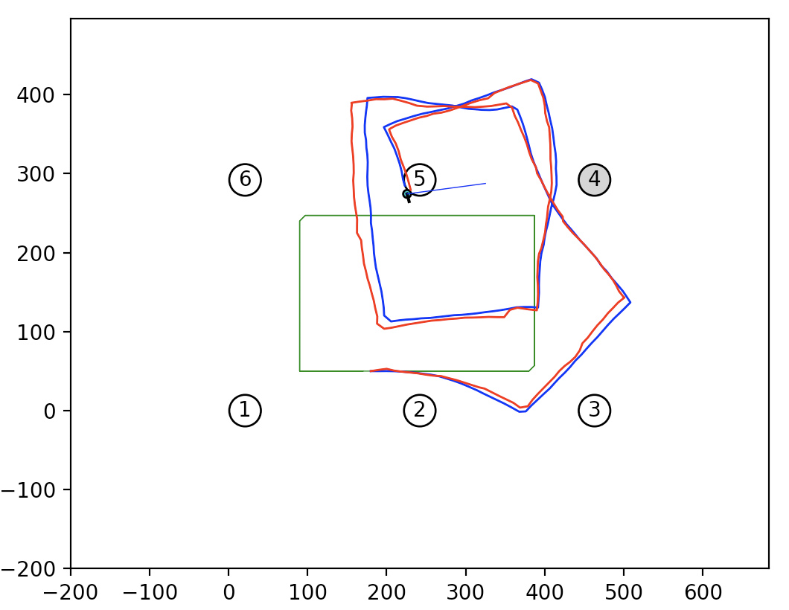

# EKF and Particle Filter for Localization

We will implement an Extended Kalman Filter (EKF) and Particle Filter (PF) for localizing a robot based on landmarks.

We will use the odometry-based motion model. We assume that there are landmarks present in the robot’s environment. The robot receives the bearings (angles) to the landmarks and the ID of the landmarks as observations: (bearing, landmark ID).

We assume a noise model for the odometry motion model with parameters α and a separate noise model for the bearing observations with parameter β. The landmark ID observation is noise-free. See the provided starter code for implementation details. At each timestep, the robot starts from the current state and moves according to the control input. The robot then receives a landmark observation from the world. We will use this information to localize the robot over the whole time sequence with an EKF and PF.

